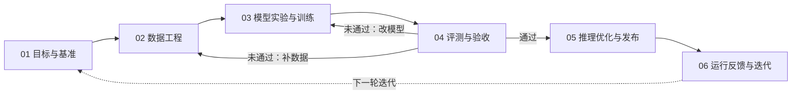

# AIGC Infra：视频生成研发全局架构

本项目按研发流程组织视频生成所需的基础设施（infra），帮助读者先理解“下一步做什么、为什么需要这个工具”，再进入模块查看细节。本文件同时作为 Codex 的全局架构依据和未来网页首页的内容入口。

范围：视频生成模型的实验、预训练或微调，以及评测、推理发布和持续迭代。整体采用 **六阶段研发地图 + 跨流程项目生命周期管理 + 统一工作台**；下文的工具名称表示能力模块，具体产品选型随模块需求确定。

## 总体分类

| 部分与详情入口 | 职责 | 为什么需要 |
| --- | --- | --- |
| 六阶段研发地图（见下文） | 定义目标、数据、训练、评测、发布与反馈的职责和工具 | 让研发顺序及各阶段的 infra 用途一目了然 |
| [项目生命周期管理](docs/platform/project-lifecycle/README.md) | 关联项目、负责人、工作项、里程碑、依赖、验收、资产与决策 | 支撑多项目、多人协作，展示进展、阻塞和交付依据 |
| [统一 DataViewer](docs/platform/data-viewer/README.md) | 共用数据抽样、实验检查、模型对比和失败案例浏览能力 | 接入现有数据与评测平台，复用多模态浏览体验 |
| [公共技术底座](docs/platform/foundation/README.md) | 提供算力、存储、任务编排、平台接入、权限与监控 | 为各研发模块和跨流程能力提供通用支撑 |

AIGC-infra 网页以六阶段研发流程展示上述工具的用途与跳转入口；实际项目从 [algorithm-template](../algorithm-template/README.md) 初始化，通过项目仓库中的文档协议维护目标及研发信息。规划中的算法组 dashboard 承接项目与 goal 汇总，AIGC-infra 链接到该入口。项目生命周期管理和 DataViewer 是[共享能力](docs/platform/README.md)，贯穿六阶段；dashboard 当前正在开发。

## 研发顺序



这是通用研发主线，实际项目可复用已有成果、并行推进工作项，并按自己的里程碑验收。先用小规模实验跑通基线，再按需要扩大数据与算力。评测口径在 01 确定，04 的评测能力贯穿实验与训练；05 中影响输出的优化需回到 04 回归验收，通过后才发布。06 按问题归因返回目标、数据、模型或推理模块。

## 六个研发模块

| 阶段与详情入口 | 做什么 / 关键产物 | 对应 infra 工具 | 为什么需要 |
| --- | --- | --- | --- |
| [01 目标与基准](docs/modules/01-goals/README.md) | 在项目仓库定义任务、问题边界、目标、约束、固定基准与验收要求 | algorithm-template 文档协议；算法组 dashboard 汇总入口（正在开发） | 记录与维护目标，固定比较口径，未来统一查看各项目及其 goal |
| [02 数据工程](docs/modules/02-data/README.md) | 采集、切片、清洗、标注、配对与划分数据；产出可追溯的数据集版本 | 视频处理流水线、标注工具、数据集版本管理 | 自动处理大量视频，保持文本、条件输入与视频配对，并隔离训练与评测数据 |
| [03 模型实验与训练](docs/modules/03-training/README.md) | 复现基线、验证算法、预训练或微调；产出实验记录与模型检查点（Checkpoint） | 训练执行器、分布式训练、实验跟踪、Checkpoint 管理 | 使用算力完成实验，支持中断恢复并复现实验结论 |
| [04 评测与验收](docs/modules/04-evaluation/README.md) | 对比生成质量、提示词遵循、时间一致性、运动质量及性能成本；产出评测报告与问题集 | 批量生成、自动评测、人工对比评审 | 在统一条件下发现进步与退化，形成发布依据 |
| [05 推理优化与发布](docs/modules/05-serving/README.md) | 优化速度与显存、完成回归验收、提供生成服务；产出可发布版本与推理接口 | 推理运行时、生成任务管理、版本发布与回滚 | 把模型变成稳定可用的服务，管理视频生成的长耗时任务 |
| [06 运行反馈与迭代](docs/modules/06-feedback/README.md) | 观察线上质量、成功率与成本，归集失败案例；产出问题归因与迭代清单 | 运行看板、反馈与失败案例管理 | 从实际使用中发现瓶颈，把改进送回对应研发环节 |

## 信息来源与协作

| 信息 | 权威来源 | 工作台用途 |
| --- | --- | --- |
| 目标、验收要求、技术知识、确认后的决策 | Git 中的 YAML 与 MD | 展示版本化定义与长期知识 |
| 作业状态、实验指标、数据与模型版本 | 训练、评测、数据及资产平台 | 采集事实并链接原始证据 |
| 项目看板、关联图、近期进展 | 根据上述来源生成、可重建的汇总视图 | 聚合展示状态、依赖、资产和变化 |

每个算法项目从 algorithm-template 初始化，使用 `project.yaml`、`docs/problem.md`、`docs/eval.md` 等协议文件定义目标与验收，并通过进展、实验、决策和资产引用贯穿研发过程。规划中的平台接入关联普通运行记录，决策级实验补简短文档。运行携带与 `project.yaml.id` 对应的 `project_id`，需要细分时增加 `task_id`；项目状态、自动验收结果和最近同步时间分别展示，证据不足时显示未知，负责人确认结论与下一步。目标维护方法见 [01 目标与基准](docs/modules/01-goals/README.md)，证据汇总原则见[生命周期设计](docs/platform/project-lifecycle/001-project-lifecycle.design.md)。

## 网页入口约定

首页按“研发流程图 → 六阶段及其 infra 用途 → 共享能力”展示，并预留算法组 dashboard 入口；不支持 Mermaid 时使用同顺序的步骤条。模块详情页列出需求、设计和工具说明，并提供返回总览的入口。dashboard 当前仅展示方案、建设计划和“正在开发”状态，配置真实地址后再开放跳转。

规划中的工作台 / dashboard 按项目组织目标、里程碑、依赖、长期知识、实验、资产和 DataViewer。各项目维护自己的定义，平台未来汇总；AIGC-infra 展示能力与平台入口。大型项目可增加 Project Hub，汇总子能力的数据、方案和历次评测，并链接底层证据。首页保持简洁，项目与工具细节在对应页面展开。

## 设计文档目录

```text
AIGC_infra/
├── README.md                         # 全局架构与首页内容
├── AGENTS.md                         # Codex 工作入口
└── docs/
    ├── modules/
    │   ├── 01-goals/README.md         # 目标与基准
    │   ├── 02-data/README.md          # 数据工程
    │   ├── 03-training/README.md      # 模型实验与训练
    │   ├── 04-evaluation/README.md    # 评测与验收
    │   ├── 05-serving/README.md       # 推理优化与发布
    │   └── 06-feedback/README.md      # 运行反馈与迭代
    ├── platform/
    │   ├── README.md                 # 共享能力导航
    │   ├── project-lifecycle/        # 生命周期定义与工作台设计
    │   ├── data-viewer/README.md     # 统一多模态浏览
    │   └── foundation/README.md      # 公共技术底座
    ├── decisions/README.md           # 跨模块架构决策索引
    └── _templates/module-document.md # 后续需求与设计的简短模板
```

`AIGC_infra` 维护共用架构、规范、模板与平台设计；真实项目的定义、知识和决策放在各自仓库中。每个模块的 `README.md` 是定义和导航入口，后续在对应目录添加 `001-<topic>.requirements.md`、`001-<topic>.design.md` 并更新索引；共享能力放入 `platform/` 对应目录，跨模块决策放入 `decisions/`。详细字段、接口、验收门槛和产品选型待逐模块确定。只有一级分类、流程或职责边界改变时才调整本总览。
