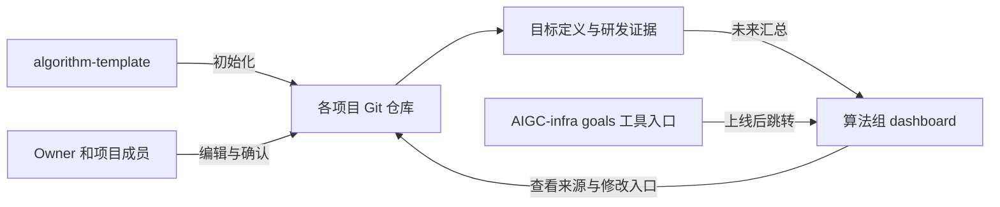

# 项目 Goal 定义、维护与 dashboard 汇总

类型：设计 · 状态：协议分工已明确 / dashboard 正在开发 · 更新：2026-10-06

[返回模块入口](README.md) · [algorithm-template 使用说明](<../../../../algorithm-template/README.md>)

## 目标与范围

Goals 模块使用 algorithm-template 作为目标与问题定义工具。每个实际项目从模板初始化，在自己的 Git 仓库维护目标及整个研发流程中的信息；算法组 dashboard 未来汇总项目与 goal，AIGC-infra 展示这套工具的功能、使用方法和 dashboard 入口。

本轮产出为说明与开发计划。dashboard 正在开发，当前网页只需预留位置并展示方案、计划及开发状态；本轮不实现 dashboard、项目采集或网页服务。

## 输入、输出与职责

| 对象 | 职责与信息归属 |
| --- | --- |
| algorithm-template | 提供单项目通信协议、文档模板和字段约定，支持人和 Agent 读写、核对目标与证据 |
| 初始化后的项目仓库 | 保存真实 goal、问题边界、评测口径、当前状态、进展、实验、决策和资产引用，是项目定义的权威来源 |
| 算法组 dashboard | 未来汇总各项目、负责人及 goal，展示定义与证据的来源和版本，并提供回到项目仓库的入口 |
| AIGC-infra | 按六阶段研发地图展示平台工具的职责、使用场景和跳转入口；goals 页面说明协议并链接 dashboard |
| 生命周期与执行平台 | 生命周期连接目标、工作项、里程碑与证据；数据、训练、评测等源平台保存实际执行事实 |

输入是业务 / 研究问题、使用场景、约束和初始证据；输出是可版本化的项目目标、验收要求、评测口径、资源引用和下一检查点。后续研发结果经原始报告、实验和决策回到项目协议中，供成员和 Agent 继续读取与维护。

dashboard 汇总计划与[生命周期设计](../../platform/project-lifecycle/001-project-lifecycle.design.md)中的可重建视图原则一致。模板已有的是 Git + Markdown + YAML 协议，平台采集与自动刷新是未来能力，不能当作模板已实现的功能。

## algorithm-template 的文件分工

以下路径均指初始化后的实际项目；链接用于查看当前模板格式。

| 文件 | 保存什么 | 与 Goal 的关系 |
| --- | --- | --- |
| [`project.yaml`](<../../../../algorithm-template/project.yaml>) | 项目 ID、Owner、当前目标 / 指标、阶段、期限、里程碑、阻塞及下一检查点 | 结构化当前值，方便项目成员、Agent 和未来 dashboard 读取 |
| [`docs/problem.md`](<../../../../algorithm-template/docs/problem.md>) | 为什么做、预期能力、输入输出、问题边界、成功与停止条件、验收表及定义变更说明 | Goal 的完整语义与验收依据 |
| [`docs/eval.md`](<../../../../algorithm-template/docs/eval.md>) | 固定评测集、指标计算、人评 / 效率口径、baseline 及关键结果索引 | 解释如何测量并判断是否满足 Goal |
| [`assets.yaml`](<../../../../algorithm-template/assets.yaml>) | 代码、数据 / 评测集、模型及作业的 ID、位置和版本 | 将 `goal.evalset` 与证据关联到可核对资产 |
| [`progress.md`](<../../../../algorithm-template/progress.md>) | 当前变化、当时指标、证据、阻塞和下一步的历史记录 | 解释目标推进过程，保留当时快照 |
| `experiments/`、`decisions/` | 关键实验的假设 / 结果与 Owner 确认的取舍 | 支持继续、调整或停止目标的理由 |
| `docs/design.md`、`docs/data.md`、`docs/delivery.md` | 方案、数据过程、最终验收与交付 | 在后续阶段持续引用目标和验收 ID |
| `AGENTS.md` | Agent 的读取、核对与维护规则 | 约定如何辅助项目，不另存目标或阈值 |

`project.yaml` 保存当前数字，文档解释含义并引用当前字段；实验、原始报告和进展保留历史。模板中的 TODO、空值、空白表单和示例属于填写说明，不能作为实际项目目标或研发证据。

## Goal 的定义流程

1. **初始化项目**：从 algorithm-template 创建项目仓库，设置 `project.yaml.id / name / owner / deadline`；已有项目可合并所需协议文件，保留原有代码和 Git 历史。一个项目指定一个最终 Owner。
2. **说明问题**：在 `docs/problem.md` 写明使用方、具体场景和失败案例、为什么现在需要解决、预期能力、输入输出及范围外事项。定义目标而非先列实现任务。
3. **填写主目标与约束**：在 `project.yaml.goal` 记录指标、方向、单位、baseline、target、current、评测集引用和证据；通过 `guardrails` 记录不能退化的指标及门槛。未知数字保持 `null`，不能用 0 代替。
4. **约定成功标准**：填写 `problem.md` 的 AC-01 至 AC-06，分别覆盖业务能力、算法效果、关键 case、工程效率、退化约束和可复现交付。每项明确判定条件、预期证据和验收人，不适用项说明理由。
5. **固定比较口径**：在 `docs/eval.md` 写清评测集 / 方法版本、单位、样本与统计方式、基线模型 / 代码 / 配置及工况；在 `assets.yaml` 登记评测集，`goal.evalset` 引用其 ID。当前阈值与指标不得在多处独立维护。
6. **确认与保存**：Owner / 使用方确认目标和验收，在 `problem.md` 记录确认；用 `project.yaml.milestones`、`next_checkpoint` 明确阶段目标、证据、责任人和期限，再提交 Git 保存定义版本。

模板 `goal` 当前是一项主指标结构；其他质量、效率或稳定性要求通过 `guardrails` 和验收表表达。用户可先记录待定要求并组织定义工作，正式比较和验收前需明确口径与必需条件；不凭模板字段齐全就判断定义或验收已通过。

六阶段研发地图与 `project.yaml.stage` 的 `definition / baseline / feasibility / validation / delivery / closed` 是两种视角，不能按编号强行一一对应。项目可并行开展数据、模型与评测，只设置必要里程碑。

## 查看与修改流程

### 当前查看方式

进入实际项目仓库的 README 导航，先查看 `project.yaml` 回答“项目目标是什么、负责人是谁、当前指标与下一检查点是什么”；再查看 `problem.md` 回答“为什么做、范围和成功标准是什么”；查看 `eval.md`、`assets.yaml` 和 `goal.evidence` 核对比较口径与证据。

需要理解变化时查 `progress.md`、关键实验和 ADR，并利用 Git 提交历史对照目标、规则与结论的修订。文档仓库版本与实际算法代码 SHA 分别保存，不能把编辑文档的提交当作算法运行版本。

### 新证据与目标变更

| 变化 | 如何维护 |
| --- | --- |
| 获得同口径的新评测结果 | 核对原始证据后更新 `goal.current / evidence` 与有关约束、资产；在进展中记录变化及影响，保留旧结果 |
| 调整目标、范围、阈值或期限 | 在对应协议文件中修改，记录理由、影响与 Owner 确认；需要记录取舍时新增 ADR，保留旧决策 |
| 更换评测集、指标算法、人评或测试工况 | 更新 `assets.yaml` 和 `eval.md` 的版本引用，调整受影响目标定义，重测 baseline；旧结果仍按原口径解释 |
| 进入里程碑或决定停止 | 按目标及验收要求核对证据，由 Owner 确认；更新里程碑 / 状态并记录进展，关闭区分 `delivered` 和 `stopped` |

修改在项目仓库通过编辑器或 Git 托管平台完成，按项目评审流程提交确认。Agent 按项目 `AGENTS.md` 辅助核对、起草和执行已授权的修订；未获目标调整授权时提供建议，由 Owner 确认。已确认的目标不能因为新结果不达标而无说明地改变，旧实验中的判定标准保持可追踪。

未来 dashboard 提供源文件 / 仓库入口，用户仍回到项目仓库修改；dashboard 重新读取已确认的定义版本并刷新视图，刷新策略待研发。AIGC-infra goals 页面维护通用使用方法与计划，不集中编辑各项目目标。

## 未来汇总到算法组 dashboard

### 汇总计划

项目从模板初始化后，未来由 dashboard 的项目登记与采集能力建立“仓库 → 项目 → 目标”的关联，展示以下内容。下表描述计划展示的信息，具体接口和登记方式待实现。

| 展示内容 | 计划读取来源 |
| --- | --- |
| 项目 ID、名称、Owner、期限 | `project.yaml.id / name / owner / deadline` |
| 问题与预期能力、范围、验收入口 | `docs/problem.md` 及源文件链接；文本摘要必须能回溯原文 |
| 主指标、方向、单位、baseline / target / current | `project.yaml.goal`，未知值显示未知 |
| 退化约束、阶段、下一检查点和阻塞 | `guardrails / stage / next_checkpoint / blockers` |
| 评测口径、固定资产与当前证据 | `goal.evalset / evidence`、`docs/eval.md`、`assets.yaml` |
| 汇总版本与新鲜度 | 项目仓库及采集的定义提交、`updated_at` 与实际采集时间；后两者分别展示 |

模板字段 `id` 映射为运行与平台使用的 `project_id`，不能另发一个不关联的项目身份。算法组归属、仓库 URL、登记来源与 ID 冲突处理由 dashboard 研发确定，不假定现有模板已包含这些字段。

汇总保留定义提交及源文档入口，以便看清“有哪些项目、各自要实现什么能力、目标和验收依据是什么”。目标值和当前证据分别显示，项目状态、规则检查及 Owner 结论分别显示。不同项目的指标 / 单位 / 评测集可能不同，汇总用于浏览，不据这些数字生成未经定义的统一排名。

dashboard 使用可重建视图，修改来源仍为项目仓库。未来采集缺失、模板未填写、权限不足或同步过期时显示原因和信息不足状态，不伪造目标或沿用旧值宣称已达标。注册范围、读取分支、确认版本及刷新策略列为研发事项。

## 网页预留位置与建设计划

### 当前网页要求

后续 Codex 开发 AIGC-infra 网页时，goals 页面按以下内容展示：

- **工具说明**：algorithm-template 是项目目标与研发信息的文档协议，展示初始化、定义、查看和修改方法，并提供已配置的模板文档入口。
- **预留区域**：标题“算法组项目与 Goals”，状态文案“正在开发”。
- **方案说明**：各项目从 algorithm-template 初始化，在项目仓库记录目标；未来汇总到算法组 dashboard，AIGC-infra 提供 dashboard 入口。
- **建设计划**：项目登记与读取 → 目标和源文档汇总 → 修改后刷新与证据关联 → 配置真实 dashboard 地址并开放跳转。

dashboard 地址尚未确定，当前只展示开发状态和建设计划。真实地址配置后再提供“查看算法组项目与 Goals”的链接；不以虚构 URL、空链接或假项目列表表示接入已经可用。当前不要求开发目标编辑器、项目采集、指标计算或实时同步功能。

本地参考资料位于与 `AIGC-infra` 同级的 `algorithm-template`，这些文件链接用于开发时阅读。正式网页的模板说明 / 仓库地址需在部署时配置，不能直接把本机绝对路径作为浏览器入口。

### 后续研发顺序

| 工作 | 计划结果 |
| --- | --- |
| 当前：展示方案与占位 | goals 使用说明、dashboard 开发状态和建设计划 |
| 项目登记及协议读取 | 确定项目来源、算法组归属、模板版本及访问权限，读取现有协议而非让用户重填目标 |
| 目标汇总与来源追踪 | 项目列表、目标 / 验收摘要、源仓库及定义版本入口 |
| 刷新及证据关联 | 目标变更后更新汇总，缺失 / 过期提示，关联评测等源证据 |
| 入口上线 | 确认真实 dashboard 地址和访问方式，在 AIGC-infra 激活跳转 |

## 验收标准

以下是文档与后续网页 / dashboard 的验收场景，本轮不表示已执行网页或平台测试。

| 阶段 | 可观察的要求 |
| --- | --- |
| 当前说明 | Goals 页面能说明 template 的用途、定义 / 查看 / 修改方法及文件分工；区分模板内容与实际项目记录 |
| 当前网页 | 显示“算法组项目与 Goals · 正在开发”和方案计划；没有声称可用的 dashboard 跳转或实时项目数据 |
| 未来汇总 | 每条目标可回到对应项目仓库、定义版本、问题与评测口径；不要求独立重填同一目标 |
| 未来更新 | 项目仓库修订目标后视图可刷新，保留变更来源与版本，未知或无法访问的信息明确说明 |
| 未来入口 | 配置真实地址后可从 AIGC-infra 跳转 dashboard 查看项目与 goal，并回到源仓库查看和修改 |

## 待定事项

dashboard 服务地址、项目登记、算法组归属、访问权限、模板 schema 兼容策略、采集分支与确认版本、刷新机制、新鲜度规则、目标摘要方式和项目 / 文档深链接。它们属于后续 dashboard 与生命周期接入设计，当前 goals 页面展示计划即可。
