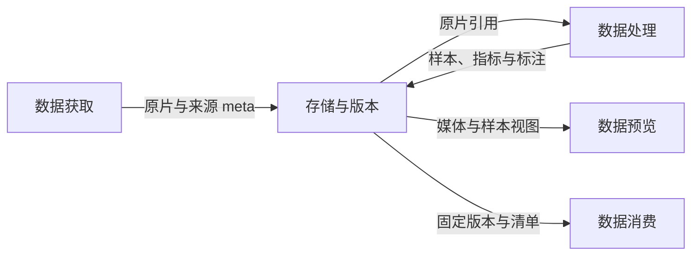

# 数据工程开发方案

类型：设计 · 状态：草案 · 已确认：下载 meta 使用 MongoDB 并在下载过程中写入 · 更新：2026-10-07

[返回模块入口](README.md) · [对应需求与参考资料](001-data-engineering.requirements.md)

## 目标与范围

在已有 MongoDB、音视频处理管线、PASS 与集群存储之上，建立可追溯的数据对象和交付协议，供后续 Codex 分步开发。媒体与元数据分离，运行事实与固定数据集版本分离，平台浏览复用 DataViewer。

现有资料中的 `raw_data`、`vidproc`、Parquet、JSONL 与目录约定作为兼容基线。下文新增字段、接口与状态机均为方案草案，须在检查实际下载器、avproc-ray 和 PASS 接口后落实映射。下载交付改进已在 [TCLOUD-12854](https://jira.myhexin.com/browse/TCLOUD-12854) 提出并处于开发中；本方案定义其上下游接入要求。

## 能力分工与权威来源

| 能力 | 承担方 | 本模块需要补齐的内容 |
| --- | --- | --- |
| 来源与下载交付 | 现有下载器及 TCLOUD-12854 开发 | 来源标识、在线写 meta、恢复与交付报告协议 |
| 元数据与处理结果 | 现有 MongoDB 与 avproc-ray | schema 映射、溯源、算子状态 / 版本、筛选协议 |
| 成品资产管理 | PASS / 数据平台 | 数据集注册、固定版本及分布报告接入；能力缺口通过适配层补齐 |
| 存储和执行 | 公共技术底座 | 媒体根目录解析、传输与校验、任务资源 / 重试 / 日志、数据库连接与访问 |
| 数据浏览 | 统一 DataViewer | 稳定样本 ID、媒体引用、caption、条件和指标读取协议 |
| 项目进展与证据 | 生命周期与工作台 | `project_id` / `task_id` / `run_id`、版本引用、校验结果及同步时间 |

Git 保存数据规则、构建配置和确认决策；MongoDB 保存下载及加工事实；存储保存媒体、特征和版本产物；PASS 管理资产登记与访问。工作台读取可重建的摘要，不能作为媒体或运行事实的第二份权威库。

## 数据链路

数据链路分两层表达：本图只展示上层模块之间的交付和读取；处理算子依赖见[处理内部管线](003-data-processing.design.md)。各模块职责与入口见[模块分层与交付](002-data-modules.design.md)。



预览与消费分别从存储读取数据。下层处理图保持各管线自己的步骤依赖，实际算子可并行或按项目重排；原片去重也可在切分前执行。下载失败、未知属性、检测失败和质量拒收分别记录，不能在某个步骤中静默丢弃。

### 处理步骤与现有阶段的对应

| 功能名称 | 参考资料中的位置 | 接入要求 |
| --- | --- | --- |
| 下载交付 | 人工验收与下载 meta | 下载状态与采集验收分开，交付原片引用及来源方法 |
| `raw_ingest` | Stage0 | 入库、媒体属性、解码兼容、HDR / SDR 预处理；旧扫盘作为历史补录入口 |
| `segment` | Stage1 | 镜头检测、字幕检测、单镜头导出或 scene 检测 / 导出、切片入库及属性 |
| `quality` | Stage2 | 去重、DOVER、美学、Qwen 内容 / 运动指标、音频质量 / 美学、同步及语义分析 |
| `analyze` | SingleShot Stage3 / MultiShot Stage4 | VAD、人像、音频语义、分布统计等；具体依赖由管线配置决定 |
| `caption` | SingleShot Stage4 / MultiShot Stage3 | caption 与融合 / 改写，记录模型、提示词和标注协议版本 |
| `condition_features` | Stage5 及特征提取草稿 | 参考图、参考音色、关键帧等；latent / 文本特征按训练模型需要另配 |

步骤身份使用 `pipeline_id + pipeline_revision + step_name`，旧阶段编号仅作显示别名。保留各管线自己的依赖顺序。Stage4 特征页为草稿、总图中的标注方案也包含候选，不据此宣布模型选型已完成。

## 数据对象与字段约定

以下为逻辑协议，实际存储字段通过适配映射；不要求直接改写所有现有集合。

| 对象 | 稳定标识与关键内容 |
| --- | --- |
| 来源规范 | `source_spec_id`、修订版本、平台 / 频道 / 关键词、来源构造方法、候选清单引用、过滤规则及负责人 |
| 下载运行 | `download_run_id`、项目 / 工作项、来源规范版本、运行状态、统计范围、开始 / 更新时间、尝试记录引用 |
| 原始媒体 | `raw_id`、来源命名空间 / 来源项 ID / 媒体规格、原始来源 JSON 引用、下载与验收状态、媒体属性、存储位置 |
| 加工样本 | `sample_id`、`raw_id`、`sample_kind`、scene / shot 关系、源时间范围、切片媒体与音频引用 |
| 算子结果 | 输入版本、算子 / 模型 / 配置版本、运行状态、指标与输出引用、失败原因、时间与 `run_id` |
| 数据集 | `dataset_id`、名称、负责人 / 团队、数据类型、来源组成及 PASS 登记引用 |
| 固定版本 | `dataset_version`、快照 / 清单摘要、构建规则版本、split、数量 / 分布、媒体及条件引用、校验报告 |

下载 meta 写入 `raw_data` 下的现有或约定 collection；切片与加工结果接入 `vidproc`。下载运行、尝试历史和版本登记的具体集合或平台表待接口盘点后确定。媒体字节、特征数组和大量日志不嵌入 MongoDB 样本记录，用资产引用保存。

### 标识、时间与路径

同一来源媒体规格通过 `(source_namespace, source_item_id, rendition_key)` 唯一定位，映射到稳定 `raw_id`；下载批次、文件路径和 `project_id` 不进入这个幂等键。多个项目可以引用同一媒体。没有源 ID 的历史素材需先建立来源映射；内容校验值辅助确认同一文件，不能未经核对把不同来源的溯源信息合并。

切片身份由原片、切分配置版本、边界和类型决定；模型或切分边界变更生成新样本或修订引用。`sample_id` 不随挂载路径变更。来源不同但内容重复的媒体保留独立来源记录，并关联同一 `duplicate_group_id`。

统一规范字段采用秒、像素、FPS、字节、kbps，注明码率是视频流码率还是容器总码率。旧 `filesize_approx`、`bitrate` 等不能仅据字段名猜单位；缺失或无法可靠换算的值保留为未知及原因。记录时间采用带时区的统一格式。

媒体引用使用 `storage_root_id + relative_path`，按目标集群解析为实际地址；相对路径不得逃出配置根目录。副本记录集群、介质、路径和校验状态，迁移副本保持 `raw_id` / `sample_id` 与逻辑版本不变。数据库凭据由底座注入，方案与版本文件只保存连接配置标识。

## 下载过程中写入 MongoDB meta

### 写入与恢复流程

1. 下载前登记来源项与规则版本，分配固定 `raw_id`、分包位置和目标媒体引用；记录 `pending`。在数据库不可用时不启动新的下载任务。
2. 原子领取记录并写入执行者、尝试 ID 和租约，进入 `downloading`。同一幂等键只有一个有效执行者；再次投递或重启先查询已有状态。
3. 下载至临时文件，在关键进度点更新已有属性和时间；原始来源 JSON 作为附件引用保留。任务失败写 `failed` 和原因，不生成第二条来源记录。
4. 文件完成并可读后检查大小 / 校验值，完成媒体提交和属性提取，再写 `succeeded`。未知属性显式记录；下载成功不等于符合全部采集要求。
5. 恢复时跳过已成功且媒体校验匹配的记录；失败或租约过期项先核对临时 / 已完成文件，再续传或重下。旧执行者的迟到回写不能覆盖新尝试结果。
6. 在明确的交付范围 / 截止点生成分布统计、元数据引用及报告；保留失败与未完成项，不能仅统计成功文件后宣称全部下载完成。

状态建议为 `pending → downloading → succeeded / failed`，失败项可开始新尝试；主动取消另记 `cancelled`。采集验收另用 `pending / passed / rejected / unknown`，并保存命中规则与人工说明。

文件提交与 MongoDB 更新之间存在失败窗口，需设计对账恢复：文件已完成但状态未写入时，按稳定目标引用补查并提交 meta；数据库已记录成功但文件缺失时，记录完整性异常并停止向后交付。恢复扫描只用于对账和历史补录，不能代替下载过程写库。

### 最小 meta 内容

| 字段组 | 建议内容 |
| --- | --- |
| 来源与归属 | `raw_id`、唯一来源键、来源 URL / 原始 ID、来源规范版本、下载运行引用 |
| 下载记录 | 状态、尝试数 / 尝试记录引用、开始 / 更新时间、错误码与说明、执行者租约 |
| 媒体与属性 | 根目录标识、相对路径、包 ID、大小 / 校验值、宽高、时长、FPS、编码、码率及类型、音频信息 |
| 规则与验收 | 采集规则版本、属性缺失原因、拒收原因、自动 / 人工验收结果与证据 |

优先建立来源幂等键的唯一约束；查询索引围绕运行范围、下载状态、来源类别和常用属性设计，具体索引组合由实际查询量与数据规模验证。分包在首次登记时固定，重试不重新编号；短剧包容量等冲突项确认后配置。

### 下载交付报告

报告引用确定的来源清单 / 运行范围和统计时间，列出候选来源项、成功、失败、取消、待处理 / 处理中数量，以及验收通过、拒收和未知数量。状态数量按同一范围核对，媒体数量与来源项数量分开，避免把电视剧季数等当作视频文件数。

按类别 / 来源统计成功数量、总时长、总大小和可用属性分布，缺失字段单独计数。附 MongoDB 逻辑引用、规则版本、来源构造方法、PASS 链接、相对目录和交付时间。完整交付与部分交付明确标记；报告快照在存储保留，工作台可查看最新进度及该次交付证据。

## 加工、质量与条件协议

### 切片与音视频关联

SingleShot 保存原片边界与切片引用；MultiShot 额外保存 `scene_id`、scene 内有序 shots、每个 shot 在原片与切片内的时间范围。统一使用相对于指定媒体的秒值和半开区间 `[start, end)`，旧时间字符串由适配器转换；保留时间轴来源，不混用原片时间与 scene 内时间。

解码、重采样、字幕裁剪、HDR 转换或压缩后记录变换参数及新媒体引用，保留原片引用。媒体转换失败单独记录；方案草案优先保留原片，不沿用图中“文件覆盖”而丢失来源。音轨选择、切片偏移和采样率变化需可追踪。现有 `av_sync.offset_sec` 的正负定义是音频早 / 晚于视频，适配时显式保留，不套用其他模型的符号约定。

### 算子结果与重算

每次算子执行记录稳定输入、代码 / 模型 / 提示词 / 配置版本及 `run_id`。状态建议为 `pending / running / succeeded / failed / skipped`，并记录失败原因。重试或指定算子重算只更新对应结果引用；历史运行与已发布版本所用结果仍可访问。算子执行是否成功和数据是否达标分开存储。

现有字段存在以下兼容问题，需逐项映射并保留原始值：

| 现有字段 / 约定 | 正确使用方式 |
| --- | --- |
| Stage2 `xxx_valid` | 按该文档修订说明只表示处理成功 / 失败，不能直接作质量通过条件；更早集合的含义需核对 |
| `watermark`、`border`、`pic_in_pic` 等布尔输出 | 资料中 True 常表示“没有问题、可保留”；标准字段须采用明确含义，如 `has_watermark`，映射时处理反向语义 |
| `qwen_quality_valid` | 同一次模型输出共享运行状态，不能将其拆成若干看似独立成功的检测 |
| DOVER / 美学 / 运动等分数 | 保留量纲、字段路径、模型版本；通过项目规则得出质量结论 |
| 缺失 / failed / skipped | 结论为未知或未满足必需条件，不填 0、False 或默认通过 |

筛选规则独立于指标计算，记录 `filter_rule_revision`。调阈值可基于同一快照重建清单，无需重跑指标。质量判定至少区分 `passed / rejected / unknown`；所需算子缺失时默认不纳入对应训练版本，例外须在规则中明确并列出数量。

下载规范对已标注 AI 合成内容的拒收要求仍保留；Stage2 文档写明删除 AI 视频检测算子，不能将其误记为现有自动检测能力。Logo 检测也不能等同于已经被 Qwen 水印算子覆盖。

去重复用现有 pHash 与重复组 / master 关系，记录算法及策略版本。现有资料对全量选高清 master 和增量保留已有 master 的策略不同，应以明确配置接入；基于相似帧的重复判断不作为字节一致性的证明。

### 标注与条件特征

caption 保存输出文本 / 结构、语言、适用模态、模型与提示词版本、输入样本引用和运行状态。SingleShot / MultiShot 可使用不同标注模板；标注算法从现有候选与 Benchmark 中验证后选定，不把总图的 Qwen、ASR 或融合步骤全部设为必选。

按项目需要保存参考图、参考音色、关键帧及其角色 / speaker、时间位置、提取方法与资产引用。保留声音与视频人物的绑定依据和不确定状态。参考素材不能来自禁止跨 split 复用的其他原片 / 作品，条件配对检查包含来源组。

latent、文本 embedding 等预编码缓存关联编码器、预处理参数、输入样本与输出校验值；更换模型 / 编码器不能继续使用旧缓存。此部分属于按需能力，具体格式与训练接口由 03 阶段共同确定。

## 数据集版本与训练交付

### 存储与现有目录兼容

沿用参考图中的逻辑结构，实际根目录由平台配置：

```text
<storage_root>/folder_<id>/
├── folder_<id>.parquet
├── <source>/
│   ├── video_clips/
│   ├── features/
│   ├── joblog/
│   ├── manifests/
│   └── <source>.parquet
└── annotations/
    └── <training_selection>.jsonl
```

数据源 / 文件夹不是逻辑版本 ID。固定版本清单与快照存放位置通过 PASS / 资产引用登记，不要求为了产生新版本复制全部媒体；媒体修订使用新路径或内容标识，已引用的媒体不得覆盖。旧目录与 JSON / JSONL 通过映射接入，不强制立即整体迁移。

### 构建与发布过程

1. 指定 `dataset_id`、元数据范围、管线 / 算子结果版本、筛选与采样配置、划分规则以及项目引用。
2. 固定所用字段和结果引用，导出不可变 Parquet 快照。只记录可变 MongoDB 查询条件不足以复现；导出期间的并发更新一致性策略需在实现时确定。
3. 在固定快照上筛选并生成排除原因和分布报告，确定样本及全部必需媒体、caption、条件引用。
4. 按原片、同作品 / 剧集、重复组及条件来源的关系建立划分组，固定 split 和随机种子；同组不得跨 train / validation / test。来源身份不明的样本先隔离，不能仅靠随机样本切分宣称无泄漏。
5. 生成 JSONL、划分清单和 manifest，校验唯一 ID、可读媒体、条件完整性、边界和成员数量。manifest 固定快照摘要、清单摘要、规则 / 代码 / schema 版本、样本数与证据引用。
6. 校验通过后发布版本登记；新筛选、重新标注或边界变更生成新版本，不能覆盖已发布清单。发布失败不暴露半完成版本。

版本至少区分“构建中、校验失败、已发布”；版本发布是资产状态，项目交付是否确认仍由负责人决定。后续算法效果评估不能由文件校验通过代替。

### 下游与跨集群副本

JSONL 的逻辑记录包含 `sample_id`、媒体引用、caption 引用或固定文本、所需条件及 split；现有训练器字段名由适配器映射。训练必须记录 `dataset_id + dataset_version` 及构建清单摘要，不能引用会继续变化的查询结果。

公共底座根据版本清单传输所选媒体、索引和条件资产至亚特兰大 OSS，必要时进入 CPFS，核对数量、大小及校验值。目标副本路径由根目录映射解析，不改写版本内的逻辑身份。源副本清理需单独满足目标校验与保留策略，数据构建成功不自动触发删除。

## 平台接入协议

以下是逻辑接口职责，传输方式、SDK / HTTP 路径及认证机制待实际平台盘点后确定。

| 接口职责 | 输入 | 输出与约束 |
| --- | --- | --- |
| 读取下载交付 | 下载运行或交付 ID | 状态计数、统计范围、来源方法、meta 和报告引用 |
| 检索样本 | 数据范围、属性 / 指标规则、游标 | 稳定 ID、归一化字段及来源；分页查询，不一次拉取全部记录 |
| 读取样本详情 | `raw_id` / `sample_id` 与结果版本 | 媒体、来源 / 切片关系、caption、条件、指标、算子状态与证据 |
| 构建固定版本 | 快照范围、规则版本、划分配置 | `build_run_id`，进度 / 日志与校验报告引用 |
| 读取版本 manifest | `dataset_id + dataset_version` | 固定清单、摘要、分布与训练 / 浏览入口 |
| 解析媒体副本 | 资产引用与目标集群 | 在调用者权限内可访问的媒体地址及副本校验状态 |

DataViewer 默认读取版本或明确的实时查询视图，支持按来源、质量、算子状态和 split 筛选，展示音视频、caption、参考素材及溯源。指标与媒体同时使用对应样本和结果版本。PASS 与 DataViewer 复用同一数据适配，不重复建立媒体库。

生命周期读取下载 / 构建 / 处理运行及版本证据；项目状态、自动校验结果、最近同步时间分开。实时 MongoDB 视图必须注明数据时间，连接不可达或同步过期显示未知及原因，不能沿用旧计数显示已完成。

## 后续 Codex 开发顺序与验收

这些是后续实施工作包，本轮仅形成方案；正式开发范围以对应需求和后续指令为依据。

| 工作包 | 开发产物 | 主要依赖与验证 |
| --- | --- | --- |
| 1. 盘点和字段映射 | 真实库 / 算子 / PASS 接口清单、样例映射、规则冲突确认 | 核对 raw / clip、单位、路径和布尔语义；确定 schema 修订 |
| 2. 下载交付接入 | 对接 TCLOUD-12854 的写库、恢复、报告协议；补齐未覆盖部分 | 与在开发需求对齐；停止恢复、并发领取、文件 / DB 失败窗口和统计核对 |
| 3. 处理协议适配 | SingleShot / MultiShot 适配、来源关联、算子结果版本与状态 | 固定小样例验证边界、音视频配对、质量失败区分及局部重算 |
| 4. 固定版本构建 | Parquet 快照、筛选 / 分组 split、JSONL 和 manifest | 重复构建一致、无跨 split 泄漏、媒体 / 条件完整性、发布不可变 |
| 5. 浏览和训练交付 | PASS / DataViewer / 工作台读取、目标存储副本和训练适配 | 原始证据可追溯，权限一致，副本校验及训练读取固定版本 |
| 6. 按需能力与规模验证 | caption Benchmark、参考特征 / 缓存、查询与导出优化 | 项目确定质量、规模与资源预算后再给出性能 / 准确率验收门槛 |

逐包按[需求验收场景](001-data-engineering.requirements.md#验收标准)形成证据。历史补录与新下载共同覆盖原始 JSON、失败记录、缺失属性等样例；迁移先对照验证再切换，旧资产引用需保持可访问。接口缺口与来源规则尚未确认的部分应明确保留待定，不能以自行推测的默认值掩盖。

## 待定事项

- 下载幂等键对无来源 ID、同来源不同清晰度 / 音轨的具体编码；下载租约与重试策略、真实 collection 划分。
- 专门下载规范与 Stage0 门槛冲突、分辨率 / FPS / 码率单位及缺失策略、HDR 转换、短剧分包口径。
- 现有 SingleShot / MultiShot 算子实现与字段版本；caption、音视频语义、参考音色及角色绑定方案。
- 元数据快照的一致性方案、结果历史保存与媒体保留策略、作品 / 重复关系不完整时的划分规则。
- PASS 资产版本接口、DataViewer schema、训练 JSONL 字段与媒体根目录映射、接入权限。
- 数据规模、性能与资源预算，质量抽检方法、标注准确率及各项目筛选 / 配比门槛。

参考依据与文件入口统一维护在[需求来源索引](001-data-engineering.requirements.md#参考资料与采用范围)。
