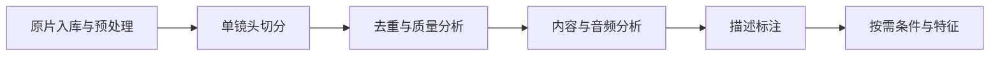

# 数据处理管线

类型：设计 · 状态：已有管线映射，算子及版本覆盖待核对 · 更新：2026-10-07

[返回模块入口](README.md) · [模块之间的交付](002-data-modules.design.md) · [加工协议](001-data-engineering.design.md#加工质量与条件协议)

## 范围与处理边界

本层由 avproc-ray 管线及算子维护角色负责，读取上层交付的原片与 meta，产出加工媒体、样本关系、指标、标注、条件资产及运行记录。来源下载、存储服务、数据集版本发布、预览和训练消费分别由上层模块负责。

## 管线图与步骤查看

网页的「数据处理管线」对应上层五个能力模块中的「数据处理」。点击 Stage 在当前页面展示所属管线、前后步骤、主要处理能力和输入输出；接口字段作为次级文档入口。处理能力按配置启用，不将同一 Stage 内所有算子强制串成线性流程。

原始结构图：[SingleShot / MultiShot 数据处理管线图](https://icn21egtt26t.feishu.cn/wiki/ZfCJw093viCnZjkV42Zc5NpVnGe)。目前此链接要求登录，尚未读取其中的画布内容；本站当前管线依赖依据已有协议，待取得可访问画布或 SVG / PNG 导出后与原图核对并接入。

## 两条管线的步骤依赖

### SingleShot

### MultiShot

以上对应现有资料中的依赖顺序；具体算子可根据项目配置并行、跳过或重排，不能把所有候选算法视为必选。SingleShot 的分析 / 标注对应 Stage3 / Stage4，MultiShot 则对应 Stage4 / Stage3。Stage 编号仅作旧管线的显示别名，正式步骤身份使用 `pipeline_id + pipeline_revision + step_name`。

## 原片入库与预处理

步骤：`raw_ingest` · 原有别名：Stage0。

读取原片引用与来源 meta，核对媒体属性、解码和音轨，按配置执行 HDR / SDR、重采样或其他预处理。记录 `raw_id`、变换参数、输出引用及状态，保留原片；历史扫盘用于补录和对账。

接口依据：[数据对象与字段](001-data-engineering.design.md#数据对象与字段约定)。

## 镜头与场景切分

步骤：`segment` · 原有别名：Stage1。

SingleShot 检测并导出单镜头切片；MultiShot 检测 scene 并保存有序 shots 及 scene / shot 关系。记录稳定 `sample_id`、`raw_id`、半开时间区间、音频偏移和切分配置版本。

接口依据：[切片与音视频关联](001-data-engineering.design.md#切片与音视频关联)。

## 去重与质量分析

步骤：`quality` · 原有别名：Stage2。

按实际管线计算重复关系、视频 / 音频质量、美学、运动、同步和语义指标。保留算法、模型与结果版本；去重策略和质量筛选规则单独版本化。

输出是指标、重复组与运行状态。执行成功、低质量、失败、跳过和未知分别表达，不能将算子执行成功当作质量通过。

接口依据：[算子结果与重算](001-data-engineering.design.md#算子结果与重算)。

## 内容与音频分析

步骤：`analyze` · 原有别名：SingleShot Stage3 / MultiShot Stage4。

按需执行 VAD、人像、说话人或音频语义等分析并保存分布结果。各算子声明输入依赖、输出字段、模型版本与失败原因，供 caption 或条件提取引用。

接口依据：[加工与质量协议](001-data-engineering.design.md#加工质量与条件协议)。

## 描述标注

步骤：`caption` · 原有别名：SingleShot Stage4 / MultiShot Stage3。

按 SingleShot / MultiShot 的标注模板生成 caption，必要时融合、改写或使用 ASR 结果。保存输入样本引用、语言、模型、提示词 / 模板版本和运行状态。模型选型以实际验证为依据。

接口依据：[标注与条件特征](001-data-engineering.design.md#标注与条件特征)。

## 条件与特征提取

步骤：`condition_features` · 原有别名：Stage5 · 按项目需要启用。

提取参考图、参考音色、关键帧等条件，记录角色 / speaker、时间位置、提取方式和来源关系。latent 与文本 embedding 由训练模型需要决定，绑定编码器、预处理版本和输入样本；具体格式与训练侧共同确认。

接口依据：[标注与条件特征](001-data-engineering.design.md#标注与条件特征)。

## 处理结果交付

处理模块将加工媒体、样本关系、指标、caption、条件资产与算子记录写回存储。数据资产模块再根据使用方规则固定快照、筛选、分组划分并发布版本。

各步骤支持基于稳定输入与配置进行局部重算。历史结果与已发布版本使用的引用仍可追溯；项目、工作项、管线、算子版本和 `run_id` 共同关联执行证据。

入口：[avproc-ray 代码](https://git-cc.myhexin.com:6443/10jqka/llm/aigc-05-04/avproc-ray) · [存储与版本职责](002-data-modules.design.md#存储与版本)

待定：实际算子清单与依赖、SingleShot / MultiShot 配置修订、质量阈值、caption 模板、条件绑定方案、编码器接口和处理性能目标。
